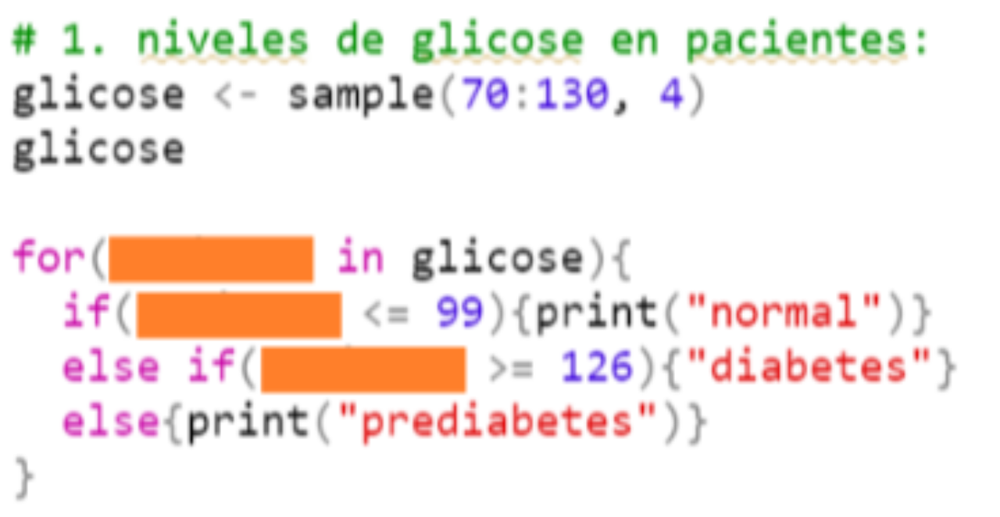
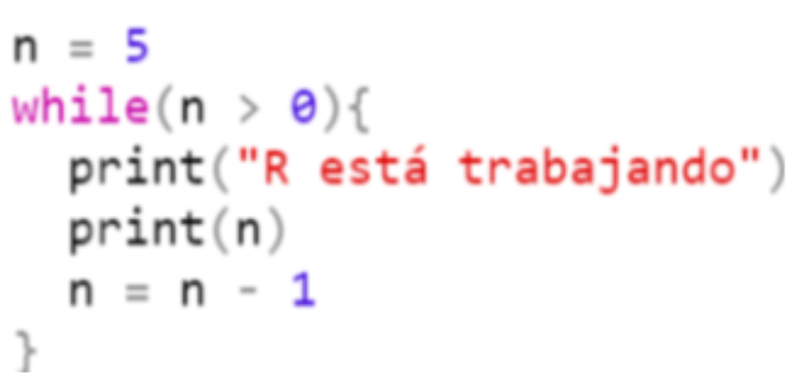

## •• Estructura de repetición ••

1.  Elija las opciones correctas para if(){}else{}:

-   [ ] Sirve para repetir uno o más comandos varias veces.
-   [x] Es una estructura de selección.
-   [ ] Sirve para ejecutar algún comando solo si se satisface alguna condición.
-   [x] Podemos usar `else if()` para poner otras condiciones.

2.  ¿Qué necesitas escribir en los cuadrados naranjas para que la función funcione?

    {width="468"}

-   [ ] Un carácter que representa cada valor en "diabetes".

-   [ ] Nada.

-   [x] Un carácter que representa cada valor en "glicose".

3.  Tomando como entrada la altura y el sexo de una persona, calcule e imprima el peso ideal:

```{r}
# Para femenino 
Fem <- c(1.65, 1.72)

for(f in Fem){
  fideal <- ((62.1 * f) - 44.7)
  print(fideal)
}

# Para masculino
Masc <- c(1.78, 1.81)

for(m in Masc){
  mideal <- ((72.7 * m) - 58)
  print(mideal)
}

```

```{r message=FALSE, warning=FALSE}
datos <- matrix(c(1.65, 1.72, 1.78, 1.81), ncol = 4)
colnames(datos) <- c(1, 1, 2, 2)

if(colnames(datos) == "1"){
  m <- (62.1 * datos) - 44.7
  print(m)
} else {
  print((72.7 * datos) - 58)
}
```

4.  Elija las opciones correctas para `while()`:

-   [ ] Sirve para ejecutar algún comando solo si se satisface alguna condición.

-   [ ] Es similar al loop `if(){}else{}.`

-   [x] Ejecuta algún código hasta que se cumpla una condición.

-   [x] Si bien la condición lógica es VERDADERA, el código no dejará de ejecutarse.

5.  ¿Qué hace este loop while()?

    {width="460"}

-   [ ] Siempre que "n" no sea 5, R no detendrá la ejecución de este ciclo.

-   [x] Siempre que "n" no sea 0, R no detendrá la ejecución de este ciclo.

-   [ ] Resta 1 de "n" hasta obtener el valor de 5.

## •• Funciones ••

6.  ¿Qué son funciones en R?

-   [ ] Son objetos que contienen valores.

-   [x] Son nombres que contienen un código R.

7.  Dé uno o más ejemplos de funciones R:

    -   `data.frame()`

    -   `ls()`

    -   `class()`

    -   `rep()`

    -   `sum()`

8.  "Los argumentos de una función son los valores que encerramos entre paréntesis para que las funciones funcionen calculando un resultado a partir de eso".

-   [x] Totalmente de acuerdo

-   [ ] Parcialmente de acuerdo

-   [ ] No se

-   [ ] Parcialmente en desacuerdo

<!-- -->

-   [ ] Muy en desacuerdo

9.  "Para las funciones que toman más de un argumento, tenemos que separar los argumentos con puntos".

-   [ ] Totalmente de acuerdo.

-   [ ] Parcialmente de acuerdo.

-   [ ] No se.

-   [ ] Parcialmente en desacuerdo.

<!-- -->

-   [x] Muy en desacuerdo.

10. Cuál es el resultado de la siguiente función: class(2, 3, 4, 5)?

-   [ ] Numeric.

-   [x] Error in class(): 4 argumentos pasados ​​a 'clase', que requiere 1.

-   [ ] Integer.

11. ¿Cuál es la sintaxis para crear una función en R?

-   [ ] 

```{r eval=FALSE, include=TRUE}
function <- f(a, b){
  j <- a + b
  j
}
```

-   [x] 

```{r eval=FALSE, include=TRUE}
f <- function(a, b){
  j <- a + b
  j
}
```

-   [ ] 

```{r eval=FALSE, include=TRUE}
f(a,b) <- function{
  j <- a + b
  j
}
```

## •• Paquetes ••

12. ¿Qué es un paquete R?

-   Contiene una familia de funciones.

-   Un grupo de funciones preestabelecidades.

-   Conjunto de funciones que permite manipular y analisar datos, crear gráficos, etc.

13. Para instalar paquetes de CRAN, ¿qué comando usamos?

-   [ ] `packages.install("nombre_paquete")`

-   [ ] `install.packages(nombre_paquete)`

-   [x] `install.packages("nombre_paquete")`

14. Para instalar paquetes de GITHUB, ¿qué comando usamos?

-   [x] `devtools::install_github("repo/nombre_paquete")`

-   [ ] `devtools::install.github(repo/nombre_paquete)`

15. ¿Cómo cargar el paquete para usarlo en R?

-   [ ] `library("nombre_paquete")`

-   [x] `library(nombre_paquete)`

-   [ ] `library_R("nombre_paquete")`

16. Es verdadero...

-   [x] `help("nombre_función")` es muy útil cuando necesitamos ayuda para comprender una función.

-   [x] Para citar los paquetes: `citation("nombre_paquete")`.

-   [ ] R no proporciona una función para obtener la cita del programa.

## •• home work! ••

1.  Durante su doctorado, pasó 2 años en el campo, una vez a la semana. La duración de cada campo fue de \~ 4 horas. En total, ¿ fuerán cuántos días de campo? ¿Y cuantas horas? Utilice R para calcular los resultados y guardarlos en los respectivos objetos: días y horas. Considerando que cada mes tenga siempre 4 semanas

```{r}
dias <- 4*24; dias
horas <- dias*4; horas

```

2.  Cree una función que calcule el total de días de campo (=ejercicio 1) simplemente dando el número de días: total_dias(x). Utilice la función para calcular un total de días para 1 y 3 años de campo.

```{r}
total_dias <- function(anos){
  d <- anos*12*4
  d
}

total_dias(1)
total_dias(3)
```

3.  Cree un vector con tres especies de animales venenosos o tres vectores de enfermedades distintos y guárdelos en un objeto.

```{r}
sp_ven <- c('Micrurus corallinus', 'Apis mellifera', 'Lonomia obliqua'); sp_ven
```

4.  Cree una matriz de datos con valores enteros aleatorios entre 0 y 100. La matriz debe contener 3 filas y 3 columnas.

```{r}
maal <- matrix(sample(0:100, 9), ncol = 3); maal
```

5.  Cree un data.frame con los datos del ejercicio 2 y el ejercicio 3. Las especies animales deben estar en las filas.

```{r}
maal <- data.frame(sp_ven, maal); maal
```

6.  Cambie el nombre de las columnas a: c("animal/vector", "2018", "2019", "2020").

```{r}
colnames(maal) <- c("animal/vector", "2018", "2019", "2020"); maal
```

7.  Haga una loop 'for' para imprimir los números almacenados en el objeto a.

```{r}
a <- sample(0:200, 30)

for(i in a){
  print(i)
}
```

8.  Haga un loop que imprime los valores del objeto "a" multiplicados por -2.

```{r}
for(i in a){
  print(i*-2)
}
```

9.  ¿Qué hacen "for", "ifelse" y "while"?

-   `for()` ejecuta un comando repetido para todos los elementos dento de un objeto (vector), `if(){}else{}` hacen agregan que ese comando se realice sólo en los elementos que tengan una condición determinada, pudiendo agregar más de una condición (con else), y `while()` aplica un comando a un grupo de datos repetidas veces terminando únicamente bajo una condición determinada por uno.

-   `for()`: es una estructura de control, específicamente de repetición, que permite repetir uno o más comandos varias veces. Es decir, dado un conjunto de valores, cada elemento i contenido dentro del conjunto, R ejecutara el comando que le asignemos dentro de los corchetes, a este comando se lo llama code. `If()`: es una estructura de control, específicamente de selección, que nos permite ejecutar algún comando solo si este satisface una cierta condición. En este caso solo puede darse 2 condiciones en este tipo de estructura de control. `While()`: es otra estructura de repetición que permite ejecutar un código hasta que el mismo cumpla con una condición preestablecida. El número de condiciones que se le puede preestablecer es mayor a 2.

10. Instale el siguiente paquete: <https://github.com/rstudio/rmarkdown>.

```{r eval=FALSE, message=FALSE, warning=FALSE, include=TRUE}
install.packages("rmarkdown")
```

\
